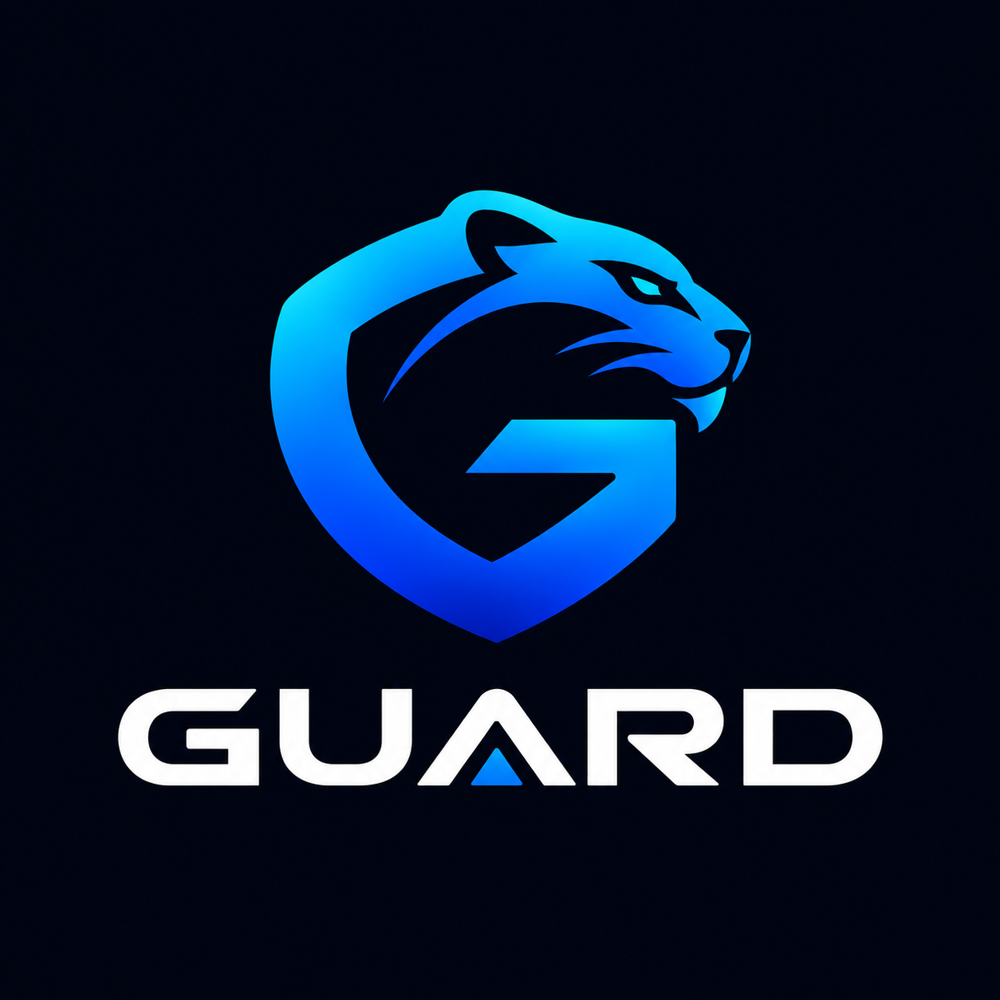

  

# GUARD Platform

Suite de cybersécurité africaine — protection des terminaux, réseaux sociaux, sites web, identité numérique et code source pour les PME et organisations d'Afrique subsaharienne.

Développée par **TRU GROUP SARL**.

## Documentation

Le cadrage complet (constitution, spécification fonctionnelle, plan d'implémentation, modèle de données, contrats API, tâches) se trouve dans [`specs/001-guard-platform/`](specs/001-guard-platform/).

## Modules

| Module | Statut | Dossier |
|---|---|---|
| GUARD ENDPOINT (niveaux 1-2 : hash + YARA) | ✅ Implémenté (backend + Android + Windows) | `backend/`, `mobile-android/`, `desktop-windows/` |
| GUARD SOCIAL, WEB, ID, CODE | ⏳ À venir | — |

## Démarrage rapide

Voir [`specs/001-guard-platform/quickstart.md`](specs/001-guard-platform/quickstart.md).
